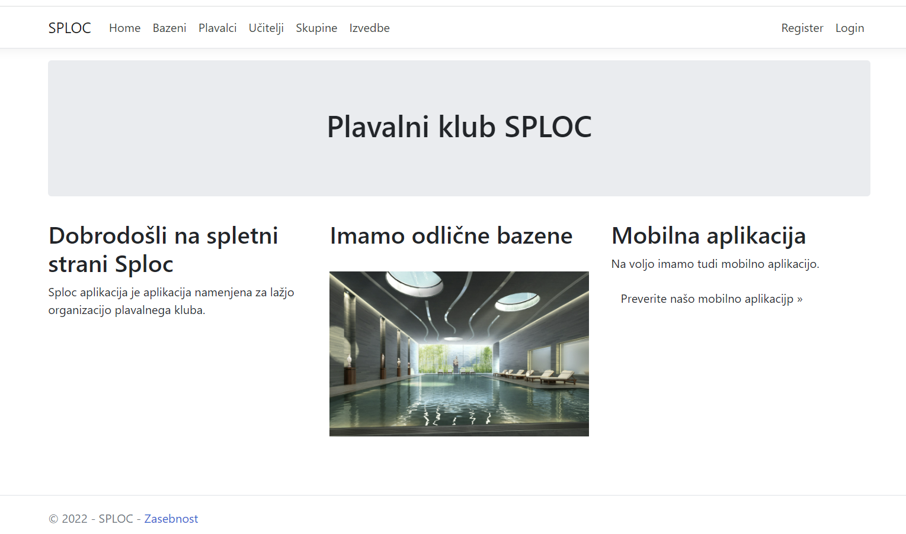
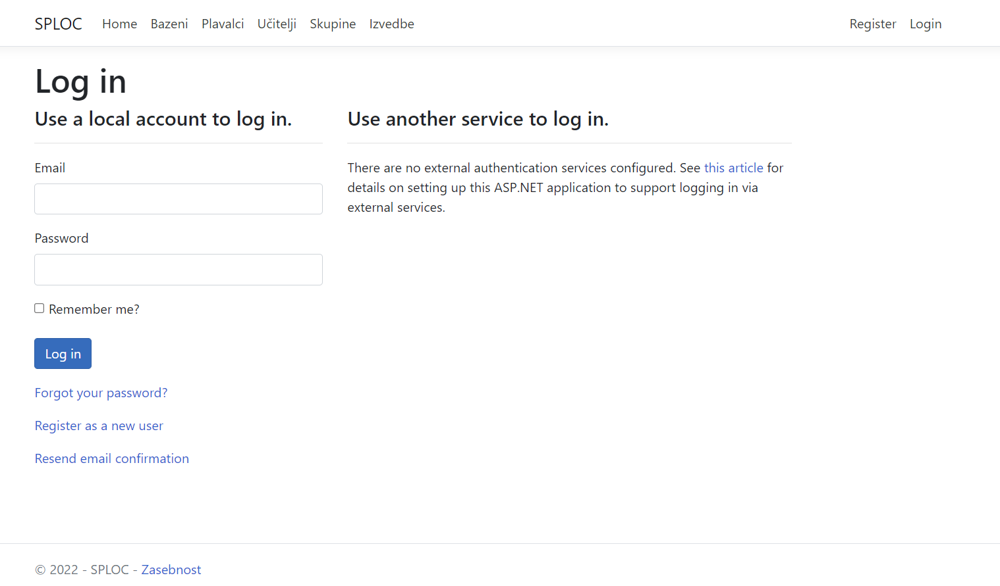
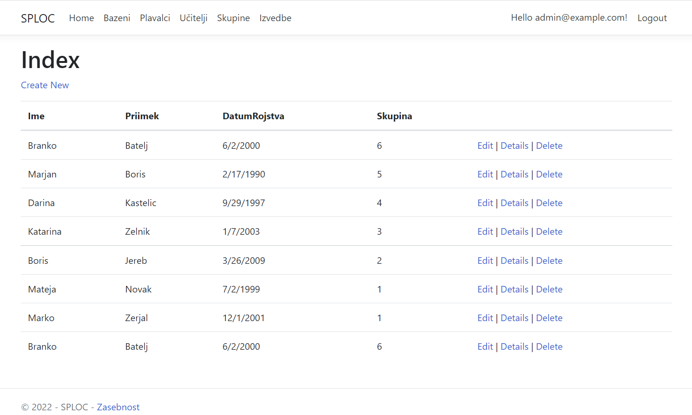
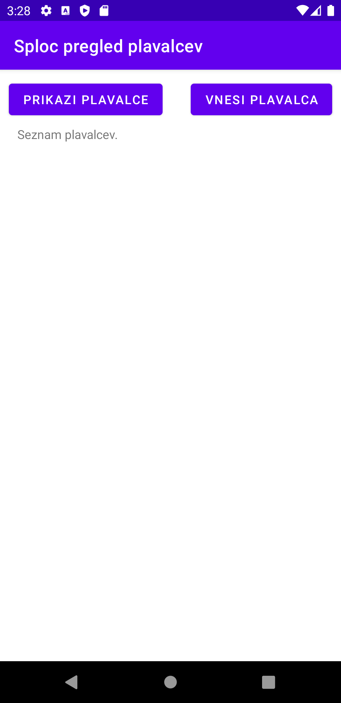
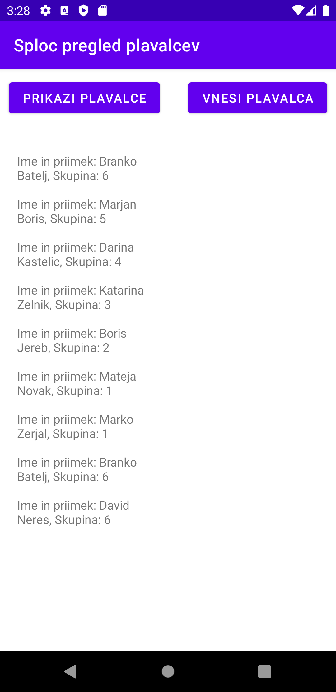
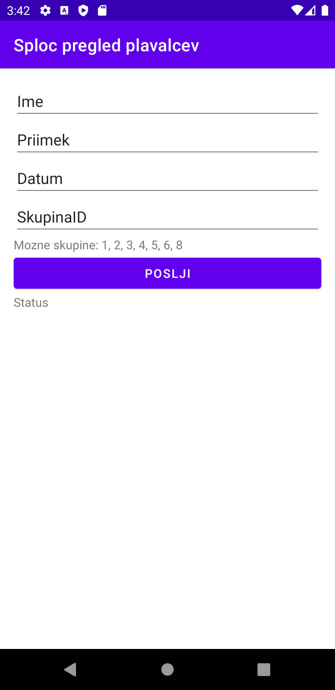
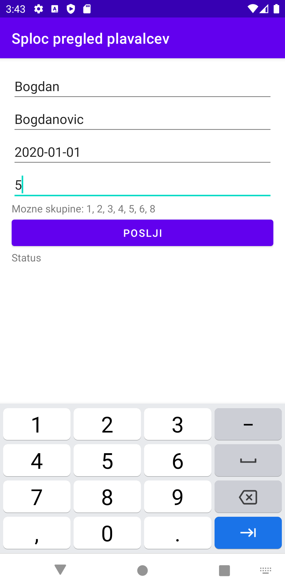
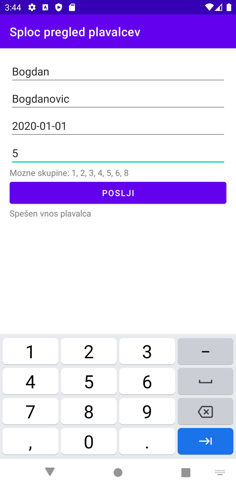

# PlavalniKlub Špljoc
## Avtorja
- Jure Branko Vidic 63160325
- Martin Čučkin 63190084

## GUI slike
### Slike spletne strani

### Slike Android aplikacije

 
 
 
 
 

## Delovanje IS

- IS je narejen po vajah, gre se za plavalni klub Sploc. Imamo Ucitelje, Plavalce, Skupine, Bazene ter Izvedbe.
Sistem podpira registracijo uporabnika in prijavo uporabnika (plavalec). Uporabnik ima omejene pravice, medtem ko ima uporabnik z vrsto računa Učitelj, vse pravice.
Aplikacija teče na Azure Web App-u in uporablja SQL bazo, ki je pravtako na Azure-ju v oblaku. Firewall je nastavljen, tako, da za dostop potrebujemo whitelistan IP naslov za dostop baze.
Uporabljamo tudi API-je, zavarovane z Api ključem. Objavljena dokumentacija API-jev na SWAGGER-ju.

- **Mobilna aplikacija** je narejena v Android Studio, testirana na napravi Pixel 3a. Aplikacija je okrnjena in namenjena učiteljem, da vidijo, kateri plavalci so vneseni. Hkrati lahko tudi vnese plavalca. Android aplikacija se preko API-jev pogovarja s spletno aplikacijo, tako je omogočeno branje in spreminjanje podatkov preko API-jev.

Uporabljeni sta metodi POST in GET (**cr**ud).
- GET se uporablja pri pridobivanju plavalcev in pri pridobivanju skupin
- POST se uporablja pri vnosu plavalca

## Opis nalog
- Martin je naredil 1. del naloge (1. zagovor).
- Jure Branko je naredil 2. del naloge (2. zagovor).

## Slika podatkovnega modela
 
 
 
